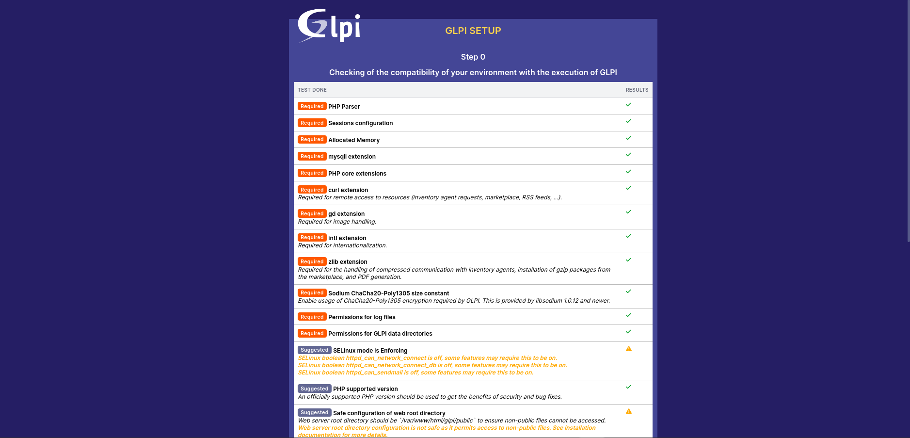
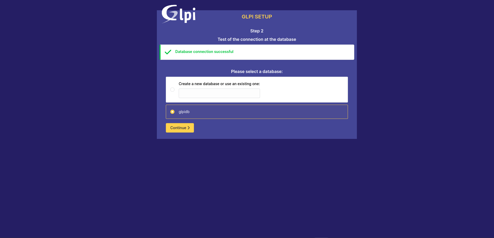

https://www.tecmint.com/install-glpi-asset-management-rhel/

# Install GLPI on CentOS 9 Stream

Since GLPI will be administered from the front end, the first step is to [install the LAMP stack](../install-LAMP-stack).

## Create a Database for GLPI

The next step is to create a database for GLPI. So, log into the MariaDB database server:

```
  sudo mysql -u root -p
```

Create a database and database user and grant all privileges on the database to the user

```
  > CREATE DATABASE glpidb;
  > GRANT ALL ON  glpidb.* TO 'glpi_user'@'localhost' IDENTIFIED BY 'P@ssword321';
  > FLUSH PRIVILEGES;
  > EXIT;
```

## Download the GLPI Installer

With the database in place, the next step is to download the GLPI installer which contains all the installation files for GLPI. Head over to the official GLPI downloads page and grab the binary file using the wget command as shown.

```bash
wget https://github.com/glpi-project/glpi/releases/download/10.0.9/glpi-10.0.9.tgz
```

Next, uncompress the tarball file to the webroot directory as follows

```bash
sudo tar -xvf  glpi-10.0.9.tgz -C /var/www/html/
```

And set the following ownership and permissions.

```bash
sudo chown -R apache:apache /var/www/html/glpi
sudo chmod -R 755 /var/www/html/glpi
```

## Create an Apache Configuration for GLPI

Next, you need to create an Apache configuration file for GLPI in the /etc/httpd/conf.d/ directory.

```bash
sudo vim /etc/httpd/conf.d/glpi.conf
```

Paste the following configuration. For the ServerName attribute, be sure to provide the server’s IP address or a registered domain name.

```bash
<VirtualHost *:80>
   ServerName SERVER_IP
   DocumentRoot /var/www/html/glpi

   ErrorLog "/var/log/httpd/glpi_error.log"
   CustomLog "/var/log/httpd/glpi_access.log" combined

   <Directory> /var/www/html/glpi/config>
           AllowOverride None
           Require all denied
   </Directory>

   <Directory> /var/www/html/glpi/files>
           AllowOverride None
           Require all denied
   </Directory>
</VirtualHost>
```

Where _SERVER_IP_ .is the IP for the GLPI server Save and exit.

Next, set the following SELinux policies.

```bash
sudo dnf -y install policycoreutils-python-utils
sudo semanage fcontext -a -t httpd_sys_rw_content_t "/var/www/html/glpi(/.*)?"
sudo restorecon -Rv /var/www/html/glpi
```

To apply all the changes, restart Apache.

```bash
sudo systemctl restart httpd
```

## Complete the GLPI Installation from Browser

Finally, to complete the installation, open your browser and visit your server’s IP.






This directs you to the login page as you can see. The default login credentials are provided below:

```
For Administrator account 	glpi / glpi
For technician account		tech / tech
For normal account		normal / normal
For postonly			postonly / postonly
```


