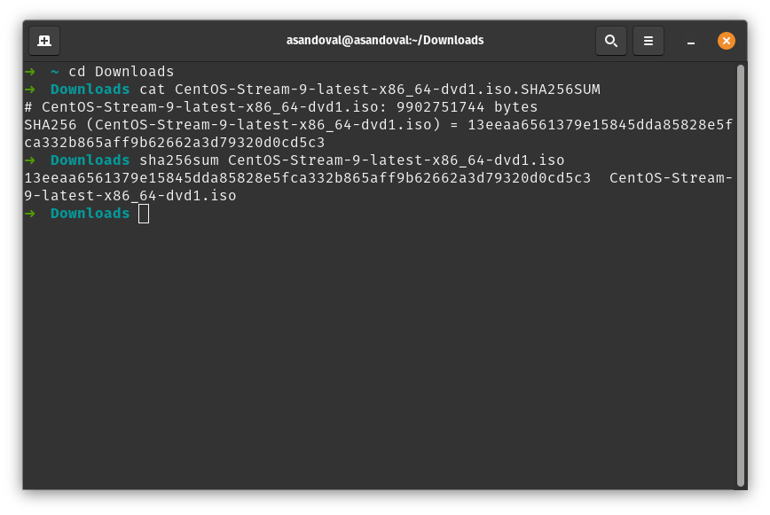

# Install CentOS 9 Stream

1. Download CentOS 9 Stream ISO on [centos.org](https://centos.org/download/) based on your architecture.

To install CentOS 9 Stream using the ISO as a Virtual Machine using [Virtual Box](https://www.virtualbox.org/wiki/Downloads).

2. [Verify CentOS 9 Stream ISO download](./tutorials/install-centos/README.md#verify-the-download-using-the-the-checksum-file) using the the checksum file.

# Verify the download using the the checksum file

After download the ISO, get the hash:

```
  sha256sum ./file-path.iso
```

Check the result with the [checksum file](https://mirror.stream.centos.org/9-stream/BaseOS/x86_64/iso/) value. It need to match. For example:



### Troubleshooting

if some some reason you get an error message like this `centos/linux: is not in the sudoers file. This incident will be reported` follow this: https://www.youtube.com/watch?v=OziJuRKw24I

### References

[https://wiki.centos.org/TipsAndTricks/sha256sum](https://wiki.centos.org/TipsAndTricks/sha256sum)
[VirtualBox - Install CentOS Stream 9
](https://www.tonystechanditblog.com/2021/04/virtualbox-install-centos-stream-8.html)
