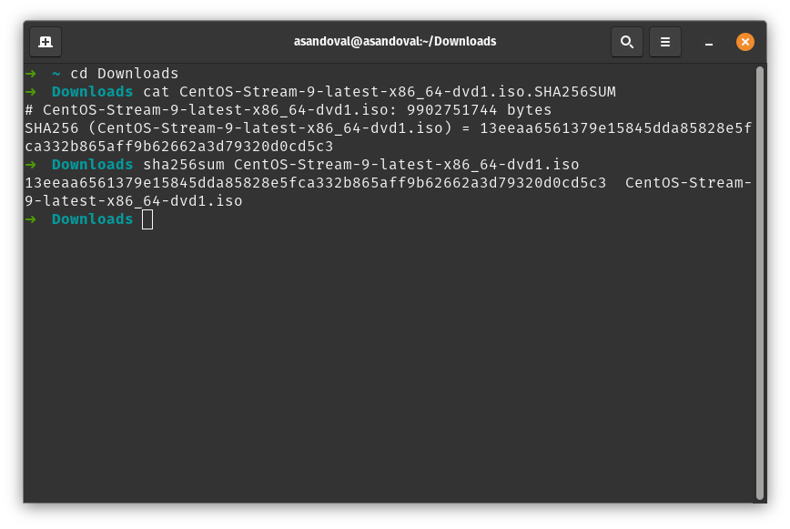

# Install the OS using the ISO as a Virtual Machine using [Virtual Box](https://www.virtualbox.org/wiki/Downloads).

https://www.tonystechanditblog.com/2021/04/virtualbox-install-centos-stream-8.html

# Verify the download using the the checksum file

After download the ISO, get the hash:

```
  sha256sum ./file-path.iso
```

Check the result with the [checksum file](https://mirror.stream.centos.org/9-stream/BaseOS/x86_64/iso/) value. It need to match. For example:



### References

[https://wiki.centos.org/TipsAndTricks/sha256sum](https://wiki.centos.org/TipsAndTricks/sha256sum)
