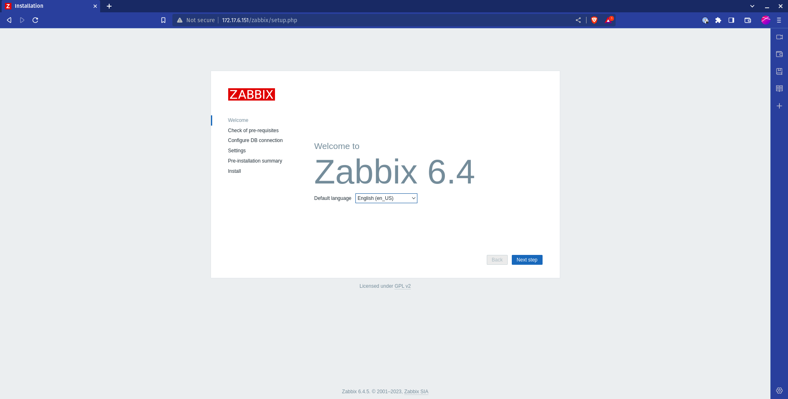
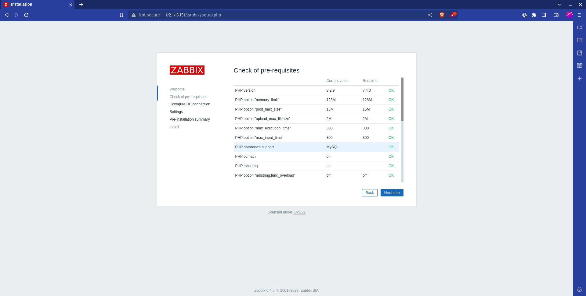
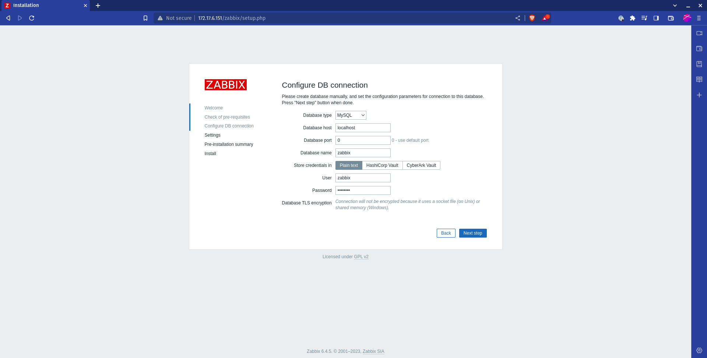
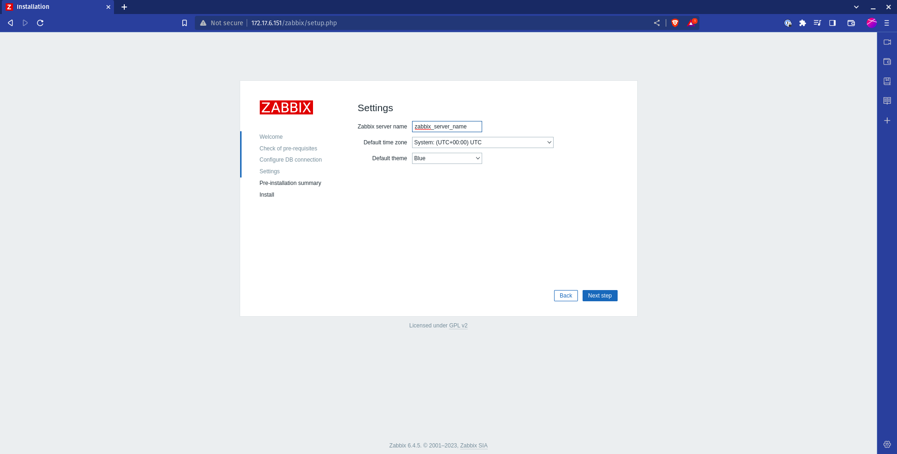
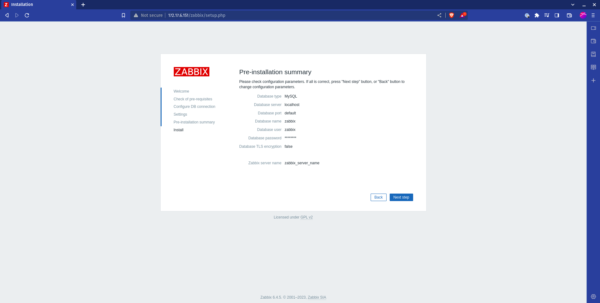

# Install Network Monitoring Solution Zabbix

Follow the instruction on [Zabbix Download](https://www.zabbix.com/download) based on your requiredment.

#### Setting up Zabbix

After complete the instruction finalize the configuration as follow:

1. Open [localhost/zabbix](http://localhost/zabbix):

2. Check the prerequisites:

3. Configure DB connection:

4. Configure settings:

5. Finalize the installation:

6. Login on Zabbix: on [localhost/zabbix](localhost/zabbix) enter with user `Admin` and password `zabbix`.
