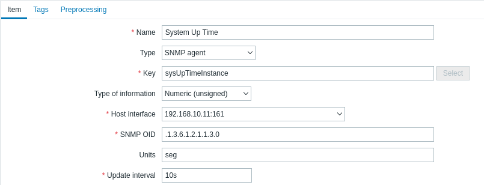

# Monitor Windows 11 using SNMP on Zabbix

To monitor a Windows 11 compute using SNMP on Zabbix can be done by:

1. [Install SNMP Service on Windows](#install-snmp-service-on-windows).
1. [Configure SNMP Service on Windows](#configure-snmp-service-on-windows).
1. [Configuring SNMP monitoring](#configuring-snmp-monitoring).

## Install SNMP Service on Windows

Go to the **Settings** > **Apps** > **Optional feature** > **Add Feature**.

Select the following features in the list and install them:

- _Simple Network Management Protocol (SNMP)_ and,
- _WMI SNMP Provider_.


## Configure SNMP Service on Windows

After the installation, SNMP services should start automatically. Open the **Services management console** (services.msc). Two new services should appear in the service list:

- SNMP Service — this is the primary SNMP agent service, that tracks activity and sends information;
- SNMP Trap — receives trap messages from local or remote SNMP agents, and forwards messages to the SNMP management software that is being run on that computer.

Open the properties of the SNMP Service. If it is stopped, restart it by pressing the **Start** button and then changing the startup type to Automatic.

Click the **Agent** tab. Fill in the **Contact** and **Location** fields (you can specify the user’s contact name and computer location). Then select the list of services from which you want to collect data and send it to the monitoring device. There are five service-based options:

- Physical;
- Applications;
- Internet;
- End-to-end;
- Datalink and subnetwork.

Click the **Security** tab. Here you can configure various security settings for your SNMP servers.

The list of **Accepted community names** contains the names of the communities whose SNMP hosts are authenticated to send SNMP requests to this computer. The community name has the same functions like login and password.

Click the **Add** button and specify the **Community Name** and one of the five access levels (None, Notify, READ ONLY, READ WRITE, READ CREATE). READ WRITE is the maximum access level at which the SNMP management server can make changes on the system. For monitoring systems, it is usually enough to select READ ONLY (the monitoring server can only poll the system, but not make changes). In our example, we added a community name **public** with **READ ONLY** permissions.

Add a list of monitoring servers (IP addresses) to the **Accept SNMP packets from these hosts** from which you want to accept SNMP packets. This could be your monitoring system, for example, Zabbix, Nagios, Icinga, OpenNMS, PRTG, and Microsoft System Center Operations Manager (SCOM).


> Tip. You can select the Accept SNMP packets from any host option. In this mode, the SNMP agent accepts packets from any host without restrictions. This option is not recommended for use on public computers. This is not safe.

Save the changes and restart the SNMP service.

> Hint. To make your Windows host receive and send SNMP queries and traps, you need to open SNMP ports in Windows Defender Firewall with Advanced Security. SNMP uses UDP as a transport protocol. Two ports are used: UDP 161 (SNMP) and UDP 162 (SNMPTRAP). You can open inbound and outbound SNMP ports in Windows Firewall using the following commands:

```bash
netsh advfirewall firewall add rule name="SNMP UDP Port 161  In" dir=in action=allow protocol=UDP localport=161

netsh advfirewall firewall add rule name="SNMP UDP Port 161 Out" dir=out action=allow protocol=UDP localport=161

netsh advfirewall firewall add rule name="SNMPTRAP UDP Port 162  In" dir=in action=allow protocol=UDP localport=162

netsh advfirewall firewall add rule name="SNMPTRAP UDP Port 162 Out" dir=out action=allow protocol=UDP localport=162
```

## Configuring SNMP monitoring on Zabbix

To start monitoring a device through SNMP, the following steps have to be performed:

### 1. Find out the SNMP string (or OID) of the item you want to monitor.

To get a list of SNMP strings, use the snmpwalk command (part of net-snmp software which you should have installed as part of the Zabbix installation) or equivalent tool:

```bash
snmpwalk -v 2c -c public <host IP> .
```

Where **public** is the name of the _Community Name_ you configured previously and **\<host IP\>** is _IP of the windows computer to be monitored_. This should give you a list of SNMP strings and their last value.

You can then go through the list until you find the string you want to monitor, e.g. if you wanted to monitor the up time system in the computer you would use the **DISMAN-EVENT-MIB::sysUpTimeInstance** string from this line:

```bash
DISMAN-EVENT-MIB::sysUpTimeInstance = Timeticks: (107418) 0:17:54.18
```

You may now use the snmpget command to find out the numeric OID for **'DISMAN-EVENT-MIB::sysUpTimeInstance = Timeticks: (107418) 0:17:54.18'**:

```bash
snmpget -v 2c -c public -On <host IP> DISMAN-EVENT-MIB::sysUpTimeInstance = Timeticks: (107418) 0:17:54.18
```

This should give you something like the following:

```bash
.1.3.6.1.2.1.1.3.0 = Timeticks: (123713) 0:20:37.13
```

### 2. [Create a host](https://www.zabbix.com/documentation/current/en/manual/config/hosts/host) corresponding to a device.


Add an SNMP interface for the host:

- Enter the Windows IP address and port number (161).
- Select the SNMP version **SNMPv2** from the dropdown.

Click on **Add** to save the host.

### 3. Create an item for monitoring.



So, now go back to Zabbix and click on Items for the SNMP host you created earlier. Depending on whether you used a template or not when creating your host, you will have either a list of SNMP items associated with your host or just an empty list. We will work on the assumption that you are going to create the item yourself using the information you have just gathered using snmpwalk and snmpget, so click on Create item.

Now save the item and go to Monitoring → Latest data for your SNMP data.

##### References

- [HOW TO INSTALL AND CONFIGURE SNMP SERVICE ON WINDOWS 10/11?](https://theitbros.com/snmp-service-on-windows-10/)

- [2 SNMP agent | zabbix.com](https://www.zabbix.com/documentation/current/en/manual/config/items/itemtypes/snmp)
